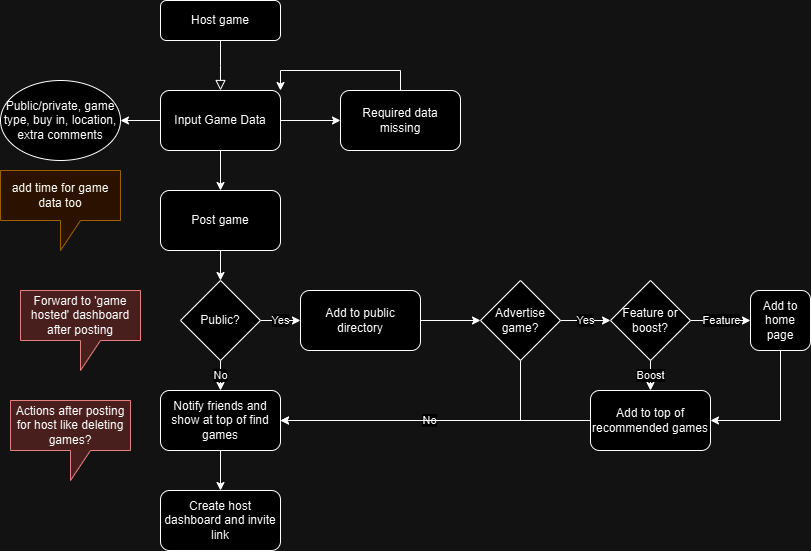

# PokerU

A social media app designed for Tulane students to easily organize and join poker games on campus, compete and have fun!

## Bug Report
Please report any bug by opening an issue in the [repo](https://github.com/tpthanh2006/PokerUNew/issues/new?assignees=&labels=bug&projects=&template=bug-report.yml). Merci!

## Feature Suggestion
Please recommend any new features by describing your idea in this [form](https://github.com/tpthanh2006/PokerUNew/issues/new?assignees=&labels=enhancement&projects=&template=new-feature.yml). Gracias!

## Code Contributions
1. **Fork the repository**: Click the "Fork" button at the top right corner of the repository page.
2. **Clone your fork**: 
  ```sh
  gh repo clone tpthanh2006/PokerUNew
  cd our_app/FrontendNew #to customize react-native app for frontend
  cd our_app/backend_new #to customize django apps for backend
  ```
3. **Create a new branch**: 
  ```sh
  git checkout -b feature-or-bugfix-name
  ```
4. **Make your changes**: Implement your feature or bug fix.
5. **Run our app**: 
  ```sh
  cd our_app/FrontendNew #navigate to our frontend folder
  npm start #run react-native app
  ```
  Follow the guide on your terminal 
6. **Commit your changes**: 
    ```sh
    git add .
    git commit -m "Describe what you've changed"
    ```
7. **Push to your fork**: 
    ```sh
    git push origin feature-or-bugfix-name
    ```
8. **Create a pull request**: Go to the [original repository](https://github.com/tpthanh2006/PokerUNew/pulls) and click the "New pull request" button. Provide a detailed description of your changes.

## Code Conventions


## ER Diagram
This diagram represents the data entities (users, games, host, players, friends) and their relationships within the campus poker app


## Installation Guide
TBD

## Known Issues
TBD

## Contact
If you need further assistance or have some questions, reach out to us on [LinkedIn](https://www.linkedin.com/company/poker-u/).

Thank you for making PokerU come true!